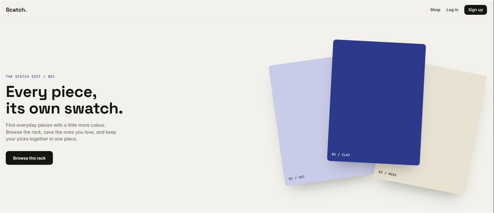
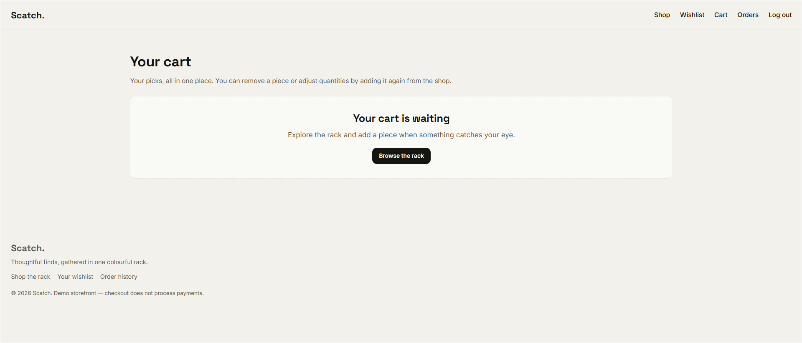
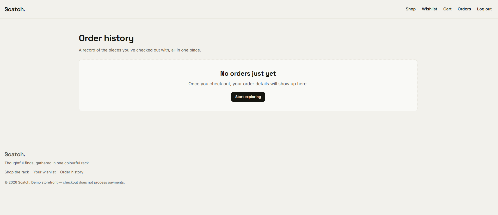

# Scatch

Scatch is a lightweight fashion storefront built with Node.js, Express, EJS, and
MongoDB. Customers can browse products with photos, save favourites, manage a
cart, and view their order history.

## Screenshots





## Features

- Browse the product collection and search by name or price.
- Create an account, log in, and log out.
- Save products to a wishlist.
- Add products to a cart, view product photos, and remove items.
- Complete the demo checkout and view past orders with product photos.
- Use the seller dashboard to add products, prices, discounts, colours, and
  optional image uploads.
- Check app and database readiness at `/health`.

## Requirements

- Node.js 22 or later.
- MongoDB, either local or hosted.

## Run locally

1. Copy `.env.example` to `.env.local`.
2. Set `MONGO_URI` to a reachable MongoDB connection string.
3. Replace `JWT_KEY` with a unique, random secret of at least 32 characters.
4. Install dependencies and start the app:

   ```sh
   npm ci
   npm start
   ```

For development with automatic restarts, run `npm run dev`. The app loads
`.env.local` first and then `.env`. If `MONGO_URI` is not set outside production,
it uses `mongodb://127.0.0.1:27017/scatch`.

The app listens on port `3000` by default. Set `PORT` in the environment to use
a different valid port. The demo checkout records orders but does not take
payment.

